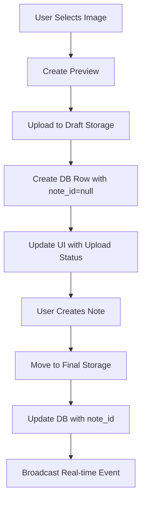
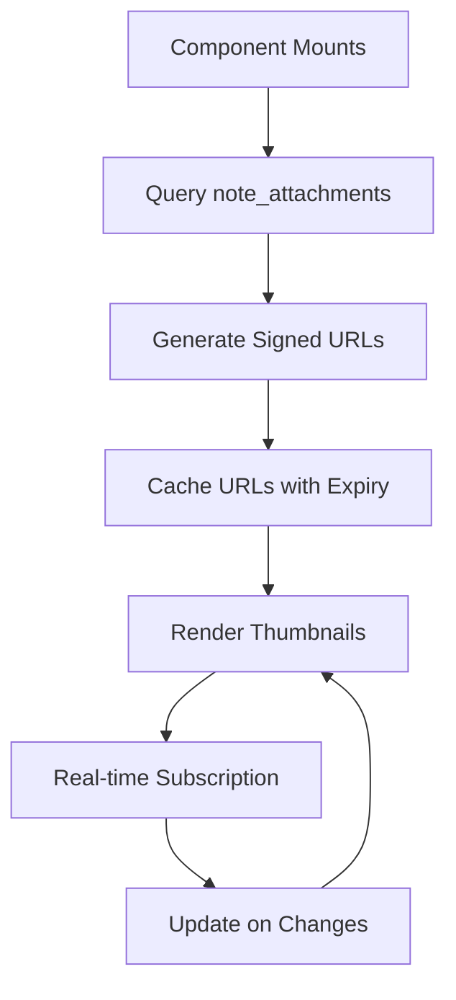
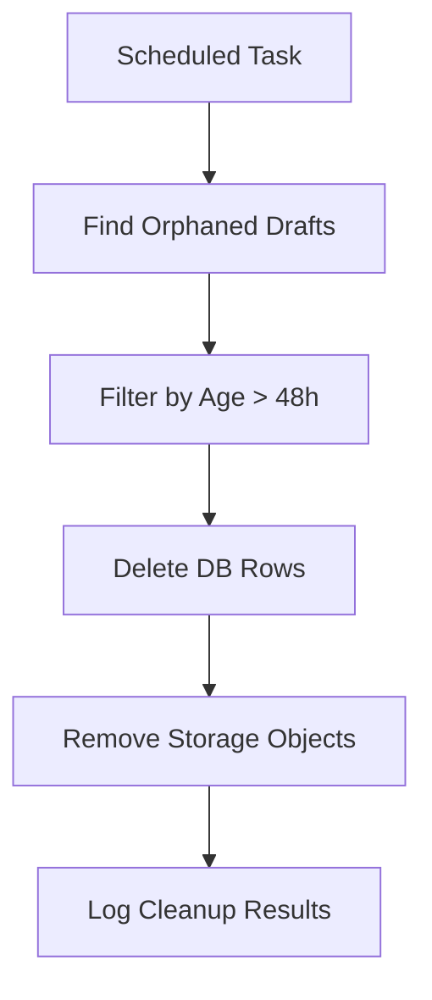

# Image Attachment System - Development Design Document

## Table of Contents

1. [System Architecture Overview](#system-architecture-overview)
2. [Database Schema](#database-schema)
3. [Data Flow Diagrams](#data-flow-diagrams)
4. [Component Architecture](#component-architecture)
5. [Storage Strategy](#storage-strategy)
6. [TypeScript Integration](#typescript-integration)
7. [Security Considerations](#security-considerations)
8. [Current Implementation Status](#current-implementation-status)
9. [Known Issues](#known-issues)
10. [Future Enhancement Opportunities](#future-enhancement-opportunities)

---

## System Architecture Overview

The Gravity Note image attachment system is designed to provide seamless integration of image attachments within the minimalist note-taking experience. The architecture follows a draft-to-final workflow that ensures data consistency and optimal user experience.

### Core Principles

- **Minimalist Integration**: Attachments enhance notes without disrupting the core "append-and-review" philosophy
- **Optimistic UX**: Immediate preview with background processing for seamless user experience
- **Draft-to-Final Workflow**: Two-stage storage system prevents orphaned files and ensures data integrity
- **Real-time Synchronization**: Live updates across devices using Supabase real-time subscriptions
- **Resilient Error Handling**: Retry logic with exponential backoff for network reliability

### System Components

```
┌─────────────────┐    ┌─────────────────┐    ┌─────────────────┐
│   Frontend UI   │    │  Storage Layer  │    │   Database      │
│                 │    │                 │    │                 │
│ • NoteInput     │◄──►│ • Supabase      │◄──►│ • note_         │
│ • NoteAttach.   │    │   Storage       │    │   attachments   │
│ • NoteEditModal │    │ • Draft/Final   │    │ • Real-time     │
│ • NoteItem      │    │   Buckets       │    │   subscriptions │
└─────────────────┘    └─────────────────┘    └─────────────────┘
```

---

## Database Schema

### `note_attachments` Table

The `note_attachments` table is the core entity for managing image attachments:

```sql
CREATE TABLE note_attachments (
    id uuid PRIMARY KEY DEFAULT gen_random_uuid(),
    note_id uuid REFERENCES notes(id), -- nullable for draft state
    user_id uuid REFERENCES auth.users(id) NOT NULL,
    kind text DEFAULT 'image' NOT NULL,
    storage_path text NOT NULL,
    mime_type text,
    size_bytes bigint,
    width integer,
    height integer,
    created_at timestamptz DEFAULT now() NOT NULL
);

-- Row Level Security enabled
ALTER TABLE note_attachments ENABLE ROW LEVEL SECURITY;

-- RLS policies ensure users can only access their own attachments
CREATE POLICY "Users can manage their own attachments"
ON note_attachments FOR ALL USING (auth.uid() = user_id);
```

### Schema Details

- **`id`**: Primary key, auto-generated UUID
- **`note_id`**: Foreign key to notes table, nullable to support draft state
- **`user_id`**: Links to authenticated user, enforces data isolation
- **`kind`**: Type of attachment, currently defaults to 'image' with future extensibility
- **`storage_path`**: Path in Supabase Storage bucket
- **`mime_type`**: Content type for proper handling (e.g., 'image/jpeg')
- **`size_bytes`**: File size for storage management
- **`width`/`height`**: Image dimensions for display optimization
- **`created_at`**: Timestamp for lifecycle management

### Missing Type Definitions Issue

**Current Problem**: The `note_attachments` table is not represented in `/types/database.ts`, which is auto-generated from Supabase schema. This causes TypeScript errors and prevents proper type checking.

**Impact**:

- Runtime errors when accessing attachment data
- No compile-time type safety for attachment operations
- IDE cannot provide proper autocomplete/IntelliSense

**Solution Required**: The database types need to be regenerated to include the `note_attachments` table definition.

---

## Data Flow Diagrams

### Upload Flow



### Display Flow



### Cleanup Flow



---

## Component Architecture

### Component Hierarchy

```
NoteInput
├── Attachment Preview Grid
│   ├── Thumbnail Components
│   └── Remove Buttons
└── File Input & Handlers

NoteItem
├── NoteAttachments
│   ├── Signed URL Management
│   ├── Thumbnail Grid
│   └── Real-time Updates
└── Note Content

NoteEditModal
├── NoteAttachments (Read-only)
└── Content Editor
```

### Key Components

#### 1. NoteInput (`/components/notes/note-input.tsx`)

**Responsibilities:**

- File selection and validation
- Draft upload coordination
- Attachment preview management
- Integration with note creation workflow

**Key Features:**

- Multi-file selection support (up to 4 images)
- Paste support for clipboard images
- Real-time preview generation
- Background upload with status tracking
- Finalization logic for note creation

**State Management:**

```typescript
type AttachmentDraft = {
  id: string
  file: File
  previewUrl: string
  error?: string | null
  status?: 'pending' | 'uploaded' | 'error'
  storagePath?: string
  rowId?: string
}
```

#### 2. NoteAttachments (`/components/notes/note-attachments.tsx`)

**Responsibilities:**

- Display finalized attachments for notes
- Signed URL generation and caching
- Real-time synchronization
- Error handling and retry logic

**Key Features:**

- Intelligent URL caching with expiry management
- Transform support for optimized thumbnails
- Real-time subscription to attachment changes
- Retry logic with exponential backoff
- Custom event handling for finalization notifications

**Optimization Features:**

- 2-hour URL caching with 10-minute buffer
- Thumbnail transformation (192x192 cover resize)
- Lazy loading for performance
- Memory-efficient URL cleanup

#### 3. NoteEditModal (`/components/notes/note-edit-modal.tsx`)

**Responsibilities:**

- Display existing attachments in read-only mode
- Content editing with attachment context
- Consistent validation and submission workflow

**Current Limitation:** Edit modal only displays existing attachments; does not support adding new attachments during editing.

---

## Storage Strategy

### Supabase Storage Configuration

**Bucket**: `note-images`
**Structure**: Hierarchical organization by user and lifecycle state

### File Path Patterns

#### Draft Storage

```
{userId}/drafts/{sessionId}/{localId}.{ext}
```

- **userId**: Ensures user data isolation
- **sessionId**: Groups uploads from same input session
- **localId**: Unique identifier for individual file
- **ext**: File extension based on MIME type

#### Final Storage

```
{userId}/{noteId}/{attachmentId}.{ext}
```

- **userId**: User data isolation
- **noteId**: Links to parent note
- **attachmentId**: Database row UUID
- **ext**: Preserved file extension

### Storage Lifecycle

1. **Draft Phase**: Files uploaded to `/drafts/` directory
2. **Finalization**: Files moved to permanent location when note is created
3. **Cleanup**: Orphaned drafts removed after 48 hours
4. **Optimization**: Thumbnails generated via transform API

### Cleanup Strategy

- **Automated Cleanup API**: `/api/attachments/cleanup`
- **Trigger**: Manual or scheduled execution
- **Criteria**: Draft files older than 48 hours with `note_id = null`
- **Process**: Database deletion followed by storage removal

---

## TypeScript Integration

### Current Type System

The attachment system lacks proper TypeScript integration due to missing database type definitions. This creates several issues:

#### Missing Types

```typescript
// These types should be auto-generated but are missing:
interface NoteAttachment {
  id: string
  note_id: string | null
  user_id: string
  kind: string
  storage_path: string
  mime_type: string | null
  size_bytes: number | null
  width: number | null
  height: number | null
  created_at: string
}

type NoteAttachmentInsert = Omit<NoteAttachment, 'id' | 'created_at'> & {
  id?: string
  created_at?: string
}

type NoteAttachmentUpdate = Partial<NoteAttachmentInsert>
```

#### Type-Safe Database Operations

```typescript
// Current implementation uses type assertions (unsafe):
const { data, error } = await (supabase as any)
  .from('note_attachments')
  .select('id, storage_path')

// Should be type-safe:
const { data, error } = await supabase
  .from('note_attachments')
  .select('id, storage_path')
```

#### Integration Requirements

- **Database Type Generation**: Include `note_attachments` in generated types
- **Component Props**: Properly typed attachment data
- **Hook Interfaces**: Type-safe mutation and query operations

---

## Security Considerations

### Row Level Security (RLS)

The system implements comprehensive security through Supabase RLS:

```sql
-- Ensures users can only access their own attachments
CREATE POLICY "Users can manage their own attachments"
ON note_attachments FOR ALL USING (auth.uid() = user_id);
```

### File Validation

**Client-Side Validation:**

- MIME type restrictions: `image/png`, `image/jpeg`, `image/webp`, `image/gif`
- File size limit: 10MB maximum
- Count limit: Maximum 4 attachments per note

**Storage Security:**

- Signed URLs with expiration (2-hour default)
- Bucket-level access controls
- Path-based user isolation

### Privacy Protection

- **User Isolation**: All file paths include user ID prefix
- **Session Isolation**: Draft files use unique session identifiers
- **Access Control**: Only authenticated users can upload/access files
- **Cleanup**: Automatic removal of orphaned draft files

---

## Current Implementation Status

### ✅ Implemented Features

1. **Core Upload System**
   - Multi-file selection and validation
   - Draft-to-final storage workflow
   - Real-time preview generation
   - Background upload processing

2. **Display System**
   - Attachment thumbnail rendering
   - Signed URL generation and caching
   - Real-time synchronization
   - Error handling and retry logic

3. **Integration**
   - Note creation workflow integration
   - Edit modal display (read-only)
   - Paste support for clipboard images
   - Mobile-responsive design

4. **Infrastructure**
   - Database schema and RLS policies
   - Storage bucket configuration
   - Cleanup API endpoint
   - Real-time subscriptions

### ⚠️ Partial Implementation

1. **Error Handling**
   - Basic retry logic implemented
   - Limited error user feedback
   - Needs comprehensive error categorization

2. **Performance Optimization**
   - URL caching implemented
   - Transform API usage
   - Needs virtual scrolling for large attachment lists

### ❌ Missing Features

1. **Edit Modal Attachments**
   - Cannot add new attachments during editing
   - No attachment management in edit mode

2. **Advanced Features**
   - Image compression before upload
   - Multiple image size variants
   - Batch operations
   - Drag-and-drop reordering

---

## Known Issues

### 1. Database Type Definitions Missing

**Issue**: The `note_attachments` table is not included in the auto-generated TypeScript types (`/types/database.ts`).

**Impact**:

- Runtime TypeScript errors in components
- No compile-time type safety
- Poor IDE experience

**Resolution Required**:

```bash
# Regenerate database types to include note_attachments
npx supabase gen types typescript --project-id <project-id> > types/database.ts
```

### 2. Display Bug in NoteAttachments

**Manifestation**: Component attempts to query `note_attachments` table but receives TypeScript errors due to missing type definitions.

**Current Workaround**: Type assertions using `(supabase as any)` to bypass TypeScript checks.

**Proper Resolution**: Include proper types in database schema generation.

### 3. Finalization Race Conditions

**Issue**: In-flight uploads may not be properly finalized if note creation happens before upload completion.

**Current Mitigation**:

- Retry logic with exponential backoff
- Event-driven finalization system
- Pending note ID tracking

**Improvement Needed**: Better coordination between upload completion and note creation events.

### 4. Limited Error User Feedback

**Issue**: Upload errors are logged but not clearly communicated to users.

**Current State**: Console logging only.

**Required Enhancement**: User-friendly error messages and retry interfaces.

---

## Future Enhancement Opportunities

### 1. Advanced Image Processing

**Compression Pipeline**

- Client-side compression before upload
- Multiple size variants (thumbnail, medium, full)
- Progressive JPEG optimization
- WebP conversion support

**Implementation Strategy:**

```typescript
// Image processing pipeline
interface ImageVariant {
  size: 'thumbnail' | 'medium' | 'full'
  width: number
  height: number
  quality: number
  format: 'webp' | 'jpeg'
}

const processImage = async (file: File): Promise<ImageVariant[]> => {
  // Implement canvas-based processing
  // Generate multiple variants
  // Return optimized files
}
```

### 2. Enhanced User Experience

**Drag-and-Drop Interface**

- Visual drop zones
- Drag reordering of attachments
- Batch selection and operations

**Progress Indicators**

- Upload progress bars
- Batch operation status
- Background sync indicators

### 3. Performance Optimizations

**Virtual Scrolling**

- Handle notes with many attachments
- Lazy loading of attachment thumbnails
- Memory-efficient rendering

**Advanced Caching**

- Service worker for offline attachment access
- IndexedDB for local attachment metadata
- Prefetching based on user behavior

### 4. Extended File Support

**Additional File Types**

- PDF documents
- Video files (with thumbnail generation)
- Audio files (with waveform visualization)
- Document previews

**Metadata Enhancement**

- EXIF data extraction and display
- Automatic image tagging
- Color palette extraction

### 5. Collaboration Features

**Shared Attachments**

- Team attachment libraries
- Attachment commenting
- Version history tracking

**Attachment Management**

- Attachment-only view
- Search within attachments
- Bulk organization tools

### 6. Integration Improvements

**External Services**

- Direct cloud storage integration (Google Drive, Dropbox)
- Image AI services for auto-tagging
- CDN integration for global distribution

**API Enhancements**

- GraphQL API for complex attachment queries
- Webhook support for external integrations
- Bulk import/export capabilities

---

## Implementation Guidelines

### Development Workflow

1. **Type Safety First**: Always regenerate database types when schema changes
2. **Error Handling**: Implement comprehensive error boundaries and user feedback
3. **Performance**: Profile attachment operations and optimize bottlenecks
4. **Security**: Regular security audits of file handling and access patterns
5. **Testing**: Unit tests for upload logic, integration tests for full workflow

### Code Quality Standards

- **TypeScript Strict Mode**: No type assertions without documented reasoning
- **Error Classification**: Use structured error handling with proper categorization
- **Component Architecture**: Single responsibility principle for attachment components
- **Performance Monitoring**: Metrics for upload success rates and performance
- **Documentation**: Inline documentation for complex upload coordination logic

### Deployment Considerations

- **Database Migrations**: Schema changes require careful migration planning
- **Storage Migration**: File migration strategies for storage path changes
- **Cache Invalidation**: Signed URL cache management during deployments
- **Monitoring**: Real-time monitoring of upload success rates and storage usage

---

## Conclusion

The Gravity Note image attachment system represents a sophisticated integration of modern web technologies to provide seamless image support within a minimalist note-taking experience. While the core functionality is well-implemented, addressing the type system issues and enhancing error handling will significantly improve the developer and user experience.

The draft-to-final workflow ensures data integrity, while the real-time synchronization provides immediate feedback across devices. The system's architecture supports future enhancements while maintaining the application's core philosophy of frictionless note capture and review.

Key priorities for improvement include resolving the database type integration, enhancing user-facing error handling, and implementing advanced image processing capabilities. These enhancements will transform the attachment system from a functional MVP into a robust, production-ready feature that truly enhances the Gravity Note experience.
