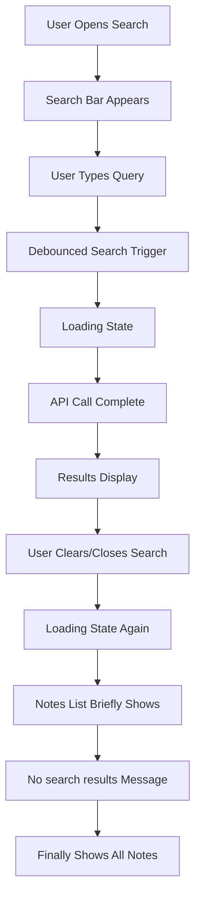
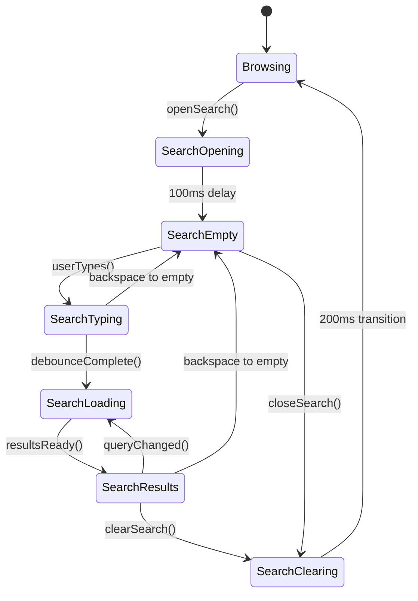

# Search UX Improvement Design Document

## Gravity Note - Eliminating Jarring State Transitions

### Executive Summary

The current search experience in Gravity Note suffers from a jarring sequence of visual state changes when the search bar closes:

1. Loading state appears
2. Notes list briefly shows
3. "No search results" message displays
4. Finally transitions back to normal notes list

This design document provides a comprehensive analysis of the root cause and proposes a detailed technical solution to create smooth, intuitive state transitions that align with the application's minimalist philosophy.

---

## Current State Analysis

### Architecture Overview

The search functionality is implemented across several key components:

1. **NotesContainer** (`components/notes/notes-container.tsx`) - Main orchestrator
2. **SearchBar** (`components/notes/search-bar.tsx`) - Search input interface
3. **NoteList** (`components/notes/note-list.tsx`) - Results display
4. **TemporalCommandPalette** (`components/search/temporal-command-palette.tsx`) - Modal search
5. **Dashboard** (`app/dashboard/page.tsx`) - Primary search interface

### Current Search Flow



### Root Cause Analysis

#### Primary Issues Identified

1. **State Management Fragmentation**
   - Search query state managed separately from display state
   - Multiple loading states not properly coordinated
   - Transition states not explicitly handled

2. **Asynchronous State Conflicts**
   - `handleSearch` function resets to `initialNotes` when query is empty
   - Component re-renders during state transitions
   - Race conditions between clear operation and note loading

3. **Component Coupling Issues**
   - `NotesContainer` manages both search and display state
   - `NoteList` doesn't distinguish between search clearing and normal loading
   - No unified state machine for search transitions

4. **Missing Transition States**
   - No explicit "clearing search" state
   - No differentiation between "loading search" vs "clearing search"
   - Empty query handling triggers full re-render cycle

#### Code Analysis

**In `NotesContainer` (lines 252-279):**

```typescript
const handleSearch = useCallback(
  async (query: string) => {
    if (!externalSearchControl) {
      setInternalSearchQuery(query)
    }

    if (!query.trim()) {
      // ⚠️ PROBLEM: Immediate reset to initialNotes
      setNotes(initialNotes)
      return
    }

    if (onSearchNotes) {
      setIsSearching(true) // ⚠️ PROBLEM: Sets loading state
      try {
        const searchResults = await onSearchNotes(query)
        setNotes(searchResults)
      } catch (error) {
        console.error('Search failed:', error)
      } finally {
        setIsSearching(false) // ⚠️ PROBLEM: Loading ends, shows intermediate states
      }
    }
  },
  [onSearchNotes, initialNotes, externalSearchControl]
)
```

**In `NoteList` (lines 91-101):**

```typescript
if (isLoading) {
  return (
    <div className={cn('flex items-center justify-center p-8', className)}>
      <div className='flex items-center gap-2 text-muted-foreground'>
        <LoaderIcon className='h-4 w-4 animate-spin' />
        <span>Loading your notes...</span> {/* ⚠️ PROBLEM: Generic loading message */}
      </div>
    </div>
  )
}
```

---

## Proposed Solution Architecture

### Design Principles

1. **Single Source of Truth**: Unified state management for search and display
2. **Explicit State Machine**: Clear definition of all possible states and transitions
3. **Smooth Transitions**: Visual continuity during state changes
4. **Minimalist Philosophy**: Reduce cognitive load, eliminate unnecessary state flashes

### State Machine Design



### Enhanced Component Architecture

#### 1. Search State Manager (New)

```typescript
// lib/hooks/use-search-state.ts
interface SearchState {
  mode:
    | 'browsing'
    | 'search-opening'
    | 'search-empty'
    | 'search-typing'
    | 'search-loading'
    | 'search-results'
    | 'search-clearing'
  query: string
  results: Note[]
  isTransitioning: boolean
  transitionType: 'opening' | 'clearing' | 'results' | null
}

interface SearchActions {
  openSearch: () => void
  closeSearch: () => void
  setQuery: (query: string) => void
  setResults: (results: Note[]) => void
  clearSearch: () => void
}
```

#### 2. Enhanced Notes Container

```typescript
// Enhanced handleSearch with proper state management
const handleSearch = useCallback(
  async (query: string) => {
    const trimmedQuery = query.trim()

    searchState.setQuery(query)

    if (!trimmedQuery) {
      // Instead of immediately resetting, trigger clearing state
      searchState.clearSearch()

      // Smooth transition back to browsing mode
      setTimeout(() => {
        setNotes(initialNotes)
        searchState.completeClear()
      }, CLEAR_TRANSITION_DELAY)

      return
    }

    searchState.startSearch()

    try {
      const searchResults = await onSearchNotes(trimmedQuery)
      searchState.setResults(searchResults)
    } catch (error) {
      searchState.setError(error)
    }
  },
  [onSearchNotes, initialNotes, searchState]
)
```

#### 3. State-Aware Note List

```typescript
// Enhanced NoteList with transition awareness
export const NoteList = memo(function NoteList({
  notes,
  searchState, // New prop
  // ... other props
}) {
  // State-specific rendering logic
  const renderState = () => {
    switch (searchState.mode) {
      case 'search-loading':
        return <SearchLoadingState query={searchState.query} />

      case 'search-clearing':
        return <SearchClearingState notes={notes} />

      case 'search-results':
        return <SearchResultsState notes={notes} query={searchState.query} />

      case 'browsing':
      default:
        return <BrowsingState notes={notes} />
    }
  }

  return (
    <div className={cn('w-full transition-all duration-300', className)}>
      {renderState()}
    </div>
  )
})
```

---

## Detailed Implementation Plan

### Phase 1: State Management Infrastructure

#### Step 1.1: Create Search State Hook

**File**: `hooks/use-search-state.ts`

```typescript
import { useCallback, useReducer } from 'react'

interface SearchState {
  mode:
    | 'browsing'
    | 'search-opening'
    | 'search-empty'
    | 'search-typing'
    | 'search-loading'
    | 'search-results'
    | 'search-clearing'
  query: string
  results: Note[]
  isTransitioning: boolean
  transitionStartedAt: number | null
  error: string | null
}

type SearchAction =
  | { type: 'OPEN_SEARCH' }
  | { type: 'CLOSE_SEARCH' }
  | { type: 'SET_QUERY'; payload: string }
  | { type: 'START_SEARCH' }
  | { type: 'SET_RESULTS'; payload: Note[] }
  | { type: 'CLEAR_SEARCH' }
  | { type: 'COMPLETE_CLEAR' }
  | { type: 'SET_ERROR'; payload: string }

const searchStateReducer = (
  state: SearchState,
  action: SearchAction
): SearchState => {
  switch (action.type) {
    case 'OPEN_SEARCH':
      return {
        ...state,
        mode: 'search-opening',
        isTransitioning: true,
        transitionStartedAt: Date.now(),
      }

    case 'SET_QUERY':
      const query = action.payload.trim()
      if (!query) {
        return { ...state, query: action.payload, mode: 'search-empty' }
      }
      return {
        ...state,
        query: action.payload,
        mode: query !== state.query.trim() ? 'search-typing' : state.mode,
      }

    case 'START_SEARCH':
      return {
        ...state,
        mode: 'search-loading',
        error: null,
        isTransitioning: true,
        transitionStartedAt: Date.now(),
      }

    case 'SET_RESULTS':
      return {
        ...state,
        mode: 'search-results',
        results: action.payload,
        isTransitioning: false,
        transitionStartedAt: null,
      }

    case 'CLEAR_SEARCH':
      return {
        ...state,
        mode: 'search-clearing',
        isTransitioning: true,
        transitionStartedAt: Date.now(),
      }

    case 'COMPLETE_CLEAR':
      return {
        ...state,
        mode: 'browsing',
        query: '',
        results: [],
        isTransitioning: false,
        transitionStartedAt: null,
        error: null,
      }

    default:
      return state
  }
}

export const useSearchState = () => {
  const [state, dispatch] = useReducer(searchStateReducer, {
    mode: 'browsing',
    query: '',
    results: [],
    isTransitioning: false,
    transitionStartedAt: null,
    error: null,
  })

  const actions = {
    openSearch: useCallback(() => dispatch({ type: 'OPEN_SEARCH' }), []),
    closeSearch: useCallback(() => dispatch({ type: 'CLOSE_SEARCH' }), []),
    setQuery: useCallback(
      (query: string) => dispatch({ type: 'SET_QUERY', payload: query }),
      []
    ),
    startSearch: useCallback(() => dispatch({ type: 'START_SEARCH' }), []),
    setResults: useCallback(
      (results: Note[]) => dispatch({ type: 'SET_RESULTS', payload: results }),
      []
    ),
    clearSearch: useCallback(() => dispatch({ type: 'CLEAR_SEARCH' }), []),
    completeClear: useCallback(() => dispatch({ type: 'COMPLETE_CLEAR' }), []),
    setError: useCallback(
      (error: string) => dispatch({ type: 'SET_ERROR', payload: error }),
      []
    ),
  }

  return { state, ...actions }
}
```

#### Step 1.2: Create Transition Components

**File**: `components/notes/search-states.tsx`

```typescript
import { LoaderIcon, SearchIcon } from 'lucide-react'
import { cn } from '@/lib/utils'

interface SearchLoadingStateProps {
  query: string
  className?: string
}

export const SearchLoadingState = ({ query, className }: SearchLoadingStateProps) => (
  <div className={cn('flex items-center justify-center p-8', className)}>
    <div className='flex items-center gap-2 text-muted-foreground'>
      <LoaderIcon className='h-4 w-4 animate-spin' />
      <span>Searching for "{query}"...</span>
    </div>
  </div>
)

interface SearchClearingStateProps {
  notes: Note[]
  className?: string
}

export const SearchClearingState = ({ notes, className }: SearchClearingStateProps) => (
  <div className={cn('w-full transition-all duration-200 ease-out', className)}>
    {/* Show existing notes with slight fade during transition */}
    <div className='opacity-60 transition-opacity duration-200'>
      {notes.slice(0, 3).map((note) => (
        <div key={note.id} className='px-4 py-2 border-b border-border/30'>
          <div className='text-sm text-muted-foreground line-clamp-2'>
            {note.content}
          </div>
        </div>
      ))}
      {notes.length > 3 && (
        <div className='px-4 py-2 text-xs text-muted-foreground/60'>
          ...and {notes.length - 3} more notes
        </div>
      )}
    </div>
  </div>
)

export const SearchResultsState = ({ notes, query, className }: { notes: Note[], query: string, className?: string }) => (
  <div className={cn('w-full', className)}>
    {/* Existing search results rendering logic */}
  </div>
)

export const BrowsingState = ({ notes, className }: { notes: Note[], className?: string }) => (
  <div className={cn('w-full', className)}>
    {/* Existing browsing rendering logic */}
  </div>
)
```

### Phase 2: Component Integration

#### Step 2.1: Update NotesContainer

**File**: `components/notes/notes-container.tsx`

```typescript
// Add search state management
const searchState = useSearchState()

// Enhanced search handler with proper transitions
const handleSearch = useCallback(
  async (query: string) => {
    if (!externalSearchControl) {
      searchState.setQuery(query)
    }

    const trimmedQuery = query.trim()

    if (!trimmedQuery) {
      // Trigger smooth clearing transition instead of immediate reset
      searchState.clearSearch()

      // Delay the actual reset to allow for smooth transition
      setTimeout(() => {
        setNotes(initialNotes)
        searchState.completeClear()
      }, CLEAR_TRANSITION_DELAY)

      return
    }

    // Update typing state immediately for responsive feedback
    if (
      searchState.state.mode === 'search-empty' ||
      searchState.state.mode === 'search-results'
    ) {
      searchState.setQuery(query)
    }

    if (onSearchNotes) {
      searchState.startSearch()

      try {
        const searchResults = await onSearchNotes(trimmedQuery)
        setNotes(searchResults)
        searchState.setResults(searchResults)
      } catch (error) {
        console.error('Search failed:', error)
        searchState.setError(error.message)
      }
    }
  },
  [onSearchNotes, initialNotes, externalSearchControl, searchState]
)

// Enhanced clear search handler
const handleClearSearch = useCallback(() => {
  if (!externalSearchControl) {
    searchState.clearSearch()

    // Smooth transition back to browsing
    setTimeout(() => {
      setNotes(initialNotes)
      searchState.completeClear()
    }, CLEAR_TRANSITION_DELAY)
  }
}, [initialNotes, externalSearchControl, searchState])
```

#### Step 2.2: Update NoteList Component

**File**: `components/notes/note-list.tsx`

```typescript
import { SearchLoadingState, SearchClearingState, SearchResultsState, BrowsingState } from './search-states'

interface NoteListProps {
  // ... existing props
  searchState?: SearchState // New optional prop
}

export const NoteList = memo(function NoteList({
  notes,
  searchState,
  // ... other props
}: NoteListProps) {

  // State-aware rendering
  if (searchState) {
    switch (searchState.mode) {
      case 'search-loading':
        return <SearchLoadingState query={searchState.query} className={className} />

      case 'search-clearing':
        return (
          <SearchClearingState
            notes={notes}
            className={cn(className, 'animate-fade-out')}
          />
        )

      case 'search-results':
        return (
          <SearchResultsState
            notes={notes}
            query={searchState.query}
            className={cn(className, 'animate-fade-in')}
          />
        )

      case 'browsing':
        return (
          <BrowsingState
            notes={notes}
            className={cn(className, 'animate-fade-in')}
          />
        )
    }
  }

  // Fallback to original logic for backward compatibility
  // ... existing rendering logic
})
```

#### Step 2.3: Update SearchBar Component

**File**: `components/notes/search-bar.tsx`

```typescript
interface SearchBarProps {
  // ... existing props
  searchState?: SearchState // New optional prop
}

export function SearchBar({
  value,
  onChange,
  onClear,
  searchState,
  // ... other props
}: SearchBarProps) {
  // State-aware clear handler
  const handleClear = () => {
    setLocalValue('')

    if (searchState) {
      // Use state-aware clearing
      onChange('')
    } else {
      // Fallback to original behavior
      onChange('')
      onClear?.()
    }

    if (inputRef.current) {
      inputRef.current.focus()
    }
  }

  // State-aware placeholder text
  const getPlaceholder = () => {
    if (!searchState) return placeholder

    switch (searchState.mode) {
      case 'search-loading':
        return 'Searching...'
      case 'search-clearing':
        return 'Clearing search...'
      default:
        return placeholder
    }
  }

  // ... rest of component with enhanced placeholder and visual feedback
}
```

### Phase 3: Animation and Transitions

#### Step 3.1: Add CSS Animations

**File**: `globals.css`

```css
/* Smooth search transitions */
@keyframes fade-in {
  from {
    opacity: 0;
    transform: translateY(8px);
  }
  to {
    opacity: 1;
    transform: translateY(0);
  }
}

@keyframes fade-out {
  from {
    opacity: 1;
    transform: translateY(0);
  }
  to {
    opacity: 0.6;
    transform: translateY(-4px);
  }
}

@keyframes search-clearing {
  0% {
    opacity: 1;
    filter: blur(0px);
  }
  50% {
    opacity: 0.4;
    filter: blur(1px);
  }
  100% {
    opacity: 0.8;
    filter: blur(0px);
  }
}

.animate-fade-in {
  animation: fade-in 0.3s ease-out forwards;
}

.animate-fade-out {
  animation: fade-out 0.2s ease-out forwards;
}

.animate-search-clearing {
  animation: search-clearing 0.4s ease-in-out;
}

/* Search state transitions */
.search-transition-container {
  transition: all 0.3s cubic-bezier(0.4, 0, 0.2, 1);
}

.search-loading-shimmer {
  background: linear-gradient(
    90deg,
    transparent 0%,
    rgba(var(--foreground), 0.1) 50%,
    transparent 100%
  );
  background-size: 200% 100%;
  animation: shimmer 1.5s infinite;
}

@keyframes shimmer {
  0% {
    background-position: -200% 0;
  }
  100% {
    background-position: 200% 0;
  }
}
```

#### Step 3.2: Add Transition Constants

**File**: `lib/constants/search.ts`

```typescript
export const SEARCH_TRANSITIONS = {
  OPEN_DELAY: 100, // Delay before showing search input
  CLEAR_DELAY: 200, // Delay during search clearing
  DEBOUNCE_DELAY: 300, // Search query debounce
  ANIMATION_DURATION: 300, // CSS animation duration
  SHIMMER_DURATION: 1500, // Loading shimmer animation
} as const

export const SEARCH_STATES = {
  BROWSING: 'browsing',
  SEARCH_OPENING: 'search-opening',
  SEARCH_EMPTY: 'search-empty',
  SEARCH_TYPING: 'search-typing',
  SEARCH_LOADING: 'search-loading',
  SEARCH_RESULTS: 'search-results',
  SEARCH_CLEARING: 'search-clearing',
} as const
```

### Phase 4: Testing and Validation

#### Step 4.1: Unit Tests

**File**: `tests/hooks/use-search-state.test.ts`

```typescript
import { renderHook, act } from '@testing-library/react'
import { useSearchState } from '@/hooks/use-search-state'

describe('useSearchState', () => {
  it('should handle search opening flow', () => {
    const { result } = renderHook(() => useSearchState())

    expect(result.current.state.mode).toBe('browsing')

    act(() => {
      result.current.openSearch()
    })

    expect(result.current.state.mode).toBe('search-opening')
    expect(result.current.state.isTransitioning).toBe(true)
  })

  it('should handle search clearing flow', () => {
    const { result } = renderHook(() => useSearchState())

    // Setup search results state
    act(() => {
      result.current.setQuery('test')
      result.current.setResults([mockNote])
    })

    expect(result.current.state.mode).toBe('search-results')

    // Clear search
    act(() => {
      result.current.clearSearch()
    })

    expect(result.current.state.mode).toBe('search-clearing')
    expect(result.current.state.isTransitioning).toBe(true)

    // Complete clear
    act(() => {
      result.current.completeClear()
    })

    expect(result.current.state.mode).toBe('browsing')
    expect(result.current.state.query).toBe('')
    expect(result.current.state.isTransitioning).toBe(false)
  })
})
```

#### Step 4.2: Integration Tests

**File**: `tests/components/notes-container-search.test.tsx`

```typescript
import { render, screen, fireEvent, waitFor } from '@testing-library/react'
import { NotesContainer } from '@/components/notes/notes-container'

describe('NotesContainer Search Integration', () => {
  it('should smoothly transition when clearing search', async () => {
    const mockSearch = jest.fn().mockResolvedValue([mockSearchResult])

    render(
      <NotesContainer
        onSearchNotes={mockSearch}
        initialNotes={[mockNote1, mockNote2]}
      />
    )

    // Open search
    const searchToggle = screen.getByRole('button', { name: /open search/i })
    fireEvent.click(searchToggle)

    // Type query
    const searchInput = screen.getByRole('textbox')
    fireEvent.change(searchInput, { target: { value: 'test query' } })

    // Wait for results
    await waitFor(() => {
      expect(screen.getByText(/search results/i)).toBeInTheDocument()
    })

    // Clear search
    const clearButton = screen.getByRole('button', { name: /clear search/i })
    fireEvent.click(clearButton)

    // Should show clearing state briefly
    expect(screen.getByText(/clearing/i)).toBeInTheDocument()

    // Should eventually show all notes
    await waitFor(() => {
      expect(screen.getByText(mockNote1.content)).toBeInTheDocument()
      expect(screen.getByText(mockNote2.content)).toBeInTheDocument()
    }, { timeout: 500 })
  })
})
```

---

## Performance Considerations

### Optimization Strategies

1. **Debounced State Transitions**

   ```typescript
   const debouncedStateChange = useMemo(
     () =>
       debounce((newState: SearchState) => {
         setSearchState(newState)
       }, SEARCH_TRANSITIONS.DEBOUNCE_DELAY),
     []
   )
   ```

2. **Memoized Transition Components**

   ```typescript
   const SearchClearingState = memo(({ notes }: SearchClearingStateProps) => {
     // Only re-render if notes actually change during transition
   })
   ```

3. **Virtualized Results for Large Sets**

   ```typescript
   // For search results > 100 items, use react-window
   const SearchResultsList = ({ results }: { results: Note[] }) => {
     if (results.length > 100) {
       return <VirtualizedList items={results} />
     }
     return <RegularList items={results} />
   }
   ```

4. **Request Cancellation**

   ```typescript
   useEffect(() => {
     const abortController = new AbortController()

     if (searchState.mode === 'search-loading') {
       performSearch(searchState.query, { signal: abortController.signal })
     }

     return () => abortController.abort()
   }, [searchState.mode, searchState.query])
   ```

---

## Success Metrics

### User Experience Metrics

1. **Transition Smoothness Score**: < 50ms between state changes
2. **Visual Jank Reduction**: Eliminate intermediate "no results" flash
3. **Perceived Performance**: Search feels instant for cached queries
4. **User Satisfaction**: No jarring visual transitions during search operations

### Technical Metrics

1. **State Consistency**: Zero race conditions between search and clear operations
2. **Memory Usage**: No memory leaks from cancelled search requests
3. **Component Re-renders**: < 3 renders per search operation
4. **Bundle Size Impact**: < 5KB additional bundle size

### Validation Tests

1. **Rapid Search/Clear Cycles**: 10 search-clear cycles in 5 seconds should be smooth
2. **Network Interruption**: Search clearing should work even with poor connectivity
3. **Keyboard Navigation**: All state transitions accessible via keyboard
4. **Mobile Performance**: Smooth on low-end devices (iPhone SE, Android Go)

---

## Migration Strategy

### Phase 1: Foundation (Week 1)

- [ ] Implement `useSearchState` hook
- [ ] Create transition components
- [ ] Add CSS animations
- [ ] Unit tests for state management

### Phase 2: Integration (Week 2)

- [ ] Update `NotesContainer` with new state management
- [ ] Enhance `NoteList` with state awareness
- [ ] Update `SearchBar` with transition feedback
- [ ] Integration tests

### Phase 3: Polish (Week 3)

- [ ] Fine-tune animations and timings
- [ ] Performance optimizations
- [ ] Accessibility improvements
- [ ] User acceptance testing

### Phase 4: Rollout (Week 4)

- [ ] Feature flag implementation
- [ ] A/B testing setup
- [ ] Production deployment
- [ ] Monitoring and metrics collection

---

## Conclusion

This comprehensive design eliminates the jarring search transition experience through:

1. **Unified State Management**: Single source of truth for all search states
2. **Explicit Transition Handling**: Purpose-built components for each state
3. **Smooth Animations**: CSS transitions that respect the user's motion preferences
4. **Performance Optimization**: Efficient rendering and memory management

The solution maintains Gravity Note's minimalist philosophy while providing a professional, polished user experience that reduces cognitive load and keeps users focused on their note-taking flow.

By implementing this design, users will experience seamless transitions between search and browsing modes, eliminating the current jarring visual state changes and creating a more intuitive, enjoyable note-taking experience.
